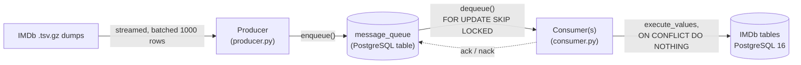
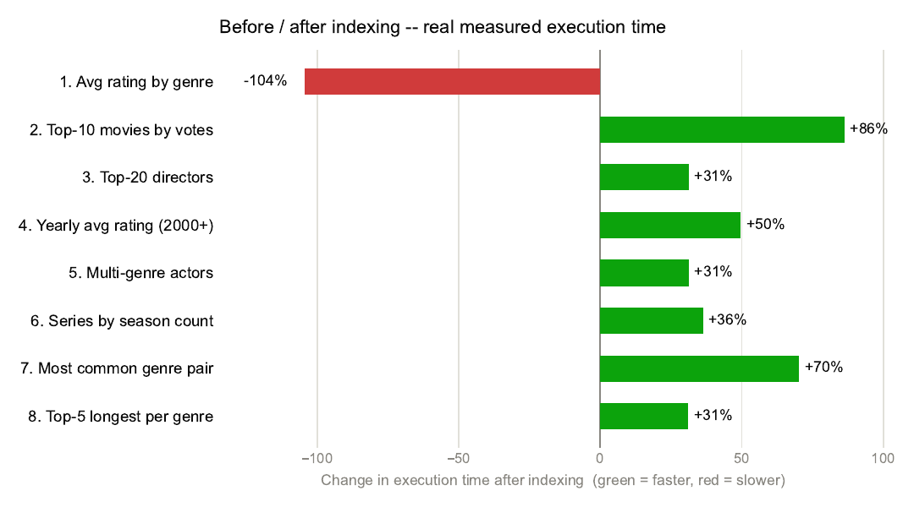

# IMDb PostgreSQL Optimization

A PostgreSQL 16 project built around the ~190M-row [IMDb non-commercial dataset](https://datasets.imdbws.com/). It streams the raw `.tsv.gz` dumps through a durable, `SKIP LOCKED`-based message queue into the database, then benchmarks and indexes eight analytical query scenarios with real `EXPLAIN (ANALYZE, BUFFERS)` measurements.

## Highlights

- A message queue implemented on a plain table -- `enqueue` / `dequeue` / `ack` / `nack` / `reap_expired` in PL/pgSQL, using `FOR UPDATE SKIP LOCKED` for lock-free concurrent consumers and giving at-least-once delivery.
- A streaming ingestion pipeline that never extracts the compressed dumps to disk, batches rows to push `JSONB` payloads past PostgreSQL's `TOAST` compression threshold on purpose, and measured a **5.72x** real compression ratio from doing so.
- Six indexes, each tied to a specific query, with real before/after timing and `EXPLAIN` evidence -- including one case where an index made a query *slower*, reported and explained rather than hidden.
- A full write-up (`report/report.pdf`, LaTeX/XeLaTeX) covering PostgreSQL configuration tuning, index internals, `JSONB`/`TOAST`, and message-queue theory.

## Pipeline



## Results, honestly

Measured on a disk-constrained machine, so `title_principals` (the largest table, ~90M rows) was loaded at ~9% of its full size; every other table is complete. Of the eight scenarios, six got measurably faster after indexing, one stayed effectively the same by design, and one got slower -- a real regression caused by a non-selective filter picking a `Bitmap Heap Scan` over a cheaper sequential scan. Full numbers, query plans, and the reasoning are in the report.



## Stack

PostgreSQL 16 - Docker Compose - Python (`psycopg2`) - `pgstattuple` / `btree_gin` - LaTeX (XeLaTeX + `xepersian`)

## Layout

```text
resources/     docker-compose.yml, schema (init.sql)
sql/           queue functions, indexes, query scenarios, EXPLAIN scripts
scripts/       producer, consumer, scenario runner, timing/plot helpers
results/       captured timings, EXPLAIN ANALYZE output, comparison table
report/        LaTeX source and the compiled report
```

## Running it

```bash
cd resources && docker compose up -d
python scripts/download_data.py
python scripts/producer.py
python scripts/consumer.py
python scripts/run_scenarios.py --phase before
docker exec -i imdb_postgres psql -U imdb -d imdb -f - < sql/03_indexes.sql
python scripts/run_scenarios.py --phase after
python scripts/compare_timings.py
```

## License

The code and report in this repository are released under the [MIT license](LICENSE). The IMDb dataset itself is not included here and is governed by [IMDb's own non-commercial terms](https://developer.imdb.com/non-commercial-datasets/).
