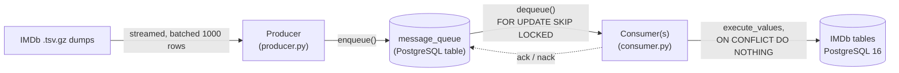

# IMDb PostgreSQL Optimization

A PostgreSQL 16 project built around the ~190M-row [IMDb non-commercial dataset](https://datasets.imdbws.com/). Raw `.tsv.gz` dumps are streamed through a `SKIP LOCKED` message queue into the database, then eight analytical queries are benchmarked and indexed with real `EXPLAIN (ANALYZE, BUFFERS)` measurements.

## Highlights

- A message queue on a plain table: `enqueue`, `dequeue`, `ack`, `nack`, `reap_expired` in PL/pgSQL, using `FOR UPDATE SKIP LOCKED` so several consumers can work at the same time without blocking each other.
- A streaming producer/consumer pipeline. Rows are batched so the `JSONB` payloads cross PostgreSQL's `TOAST` compression threshold on purpose. Measured compression ratio: 5.72x.
- Six indexes, each built for one specific query, with real before/after timing and `EXPLAIN` evidence. One index actually made a query slower, and that's in the report too, not left out.
- A full write-up (`report/report.pdf`) on PostgreSQL configuration, index types, `JSONB`/`TOAST`, and message-queue theory.

## Pipeline



## Results

Loaded on a machine with limited disk space, so `title_principals` (the biggest table, ~90M rows) only has about 9% of its rows. Every other table is complete. Six of the eight scenarios got faster after indexing, one stayed about the same by design, and one got slower because the filter wasn't selective enough for the index to pay off. Full numbers and query plans are in the report.


## Stack

PostgreSQL 16 - Docker Compose - Python (`psycopg2`) - `pgstattuple` / `btree_gin` - LaTeX (XeLaTeX + `xepersian`)

## Layout

```text
resources/     docker-compose.yml, schema (init.sql)
sql/           queue functions, indexes, query scenarios, EXPLAIN scripts
scripts/       producer, consumer, scenario runner, timing/plot helpers
results/       captured timings, EXPLAIN ANALYZE output, comparison table
report/        LaTeX source and the compiled report
```

## Running it

```bash
cd resources && docker compose up -d
python scripts/download_data.py
python scripts/producer.py
python scripts/consumer.py
python scripts/run_scenarios.py --phase before
docker exec -i imdb_postgres psql -U imdb -d imdb -f - < sql/03_indexes.sql
python scripts/run_scenarios.py --phase after
python scripts/compare_timings.py
```

## License

The code and report in this repository are released under the [MIT license](LICENSE). The IMDb dataset itself is not included here and is governed by [IMDb's own non-commercial terms](https://developer.imdb.com/non-commercial-datasets/).
